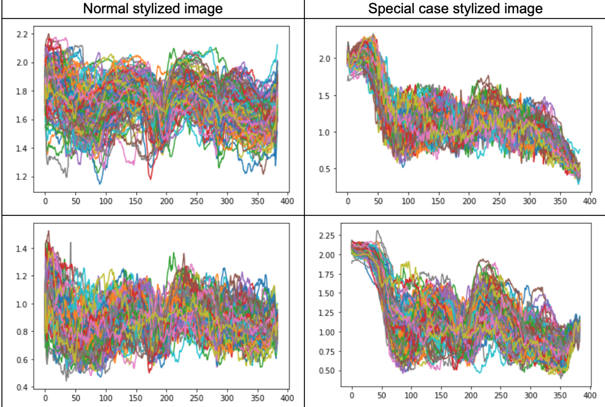
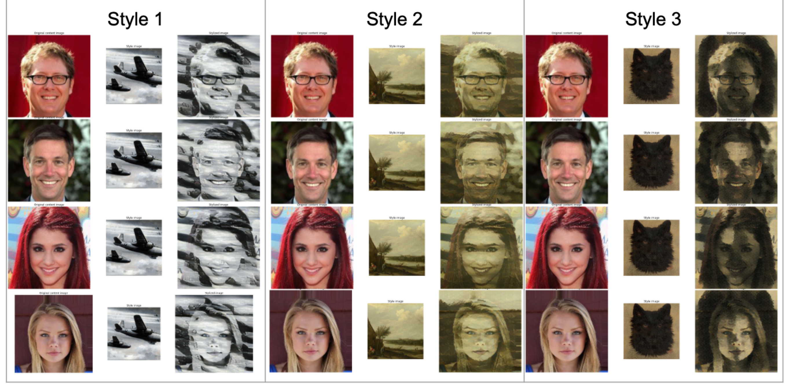
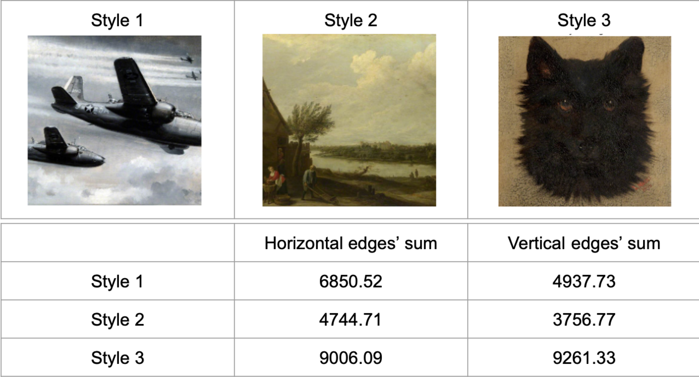
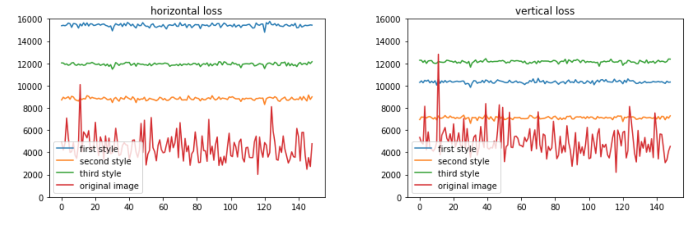
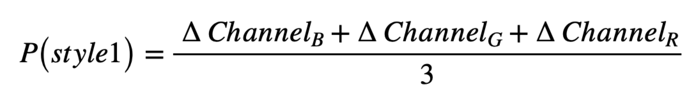
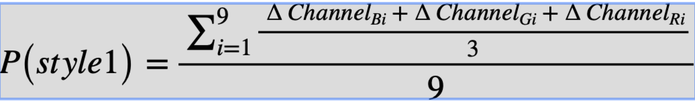
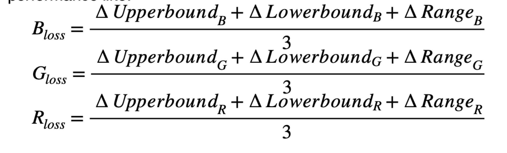

# CS585-Styler-Transfer

## What is Neural Style Transfer 
Neural style transfer is a optimization technique used to take two images, one is the content image, another is the style image. And the output image looks like the content image, but the style will look like the style reference image. Neural style transfer implemented by optimizing the output image to match the content statistics of the content image and the style statistics of the style reference image. These statistics are extracted from the images using a convolutional network.

## Project Overview
For this project, we mainly use TensorFlow_hub to realize style transfer. And our key points are not about to train an style transfer model. What we mind is what kind of styles are hard to learn or what kind of content pictures(especially face images) will fail to transfer. We try many groups of content images and style images to find problems in style transfer .

## Project Procedure
1. Collect celebrity face images and style images.
2. Do style transfer by TensorFlow_hub, and compare the stylied images with content images and style images. Then we filter out some bad cases to do simulation. 
3. For quantitative metric, We think about content loss and style loss to evaluate the stylized image.
4. For qualitative metric, it's mainly based on whether the stylied images keep the outline of the faces or whether the hue of sytle images match the hue of stylized images.

## Content Loss and Related Problems
### Content Loss
We mainly sperate horizontal and vertical sum of edges using edge detection. and compare it between style images and content images.
The reason why we think about this method is we find when there is an obvious boundary between the upper and lower colors in the style image,the original image will retain such features after conversion, even if there is no obvious boundary between the upper and lower colors in the original image.
#### Related Problem
##### 1. Falsely learn the color distribution of style images
When there is an obvious boundary between the upper and lower colors in the style image, the original image will retain such features after conversion, even if there is no obvious boundary between the upper and lower colors in the original image.

  

We use the sum of all the pixels on the Y-axis of the stylized image to measure this problem. The following table shows the stylized image curves for normal style images (output stylized images are reasonably well) and special cases (the styles we mentioned above) on 150 different celebrities’ faces. A stylized image with distinct boundaries will result in a stylized image with very clear steps in the curve shown below. This may be because style transfer not only learns the style of style image, but also leaves the color distribution to the stylized image.

  

##### 2. Falsely learn the edge distribution of style images
Human face is like a circle, which means that the vertical edges is roughly equal to the horizontal edges. At the mean time, we notice that if a style image contain more horizontal edges than vertical edges. The stylized image using this style will also show the same feature and vise versa. Here we show three style images the first style image contain more horizontal edges than vertical edges, while the last one is like human faces who have almost equal horizontal and vertical edges.
Here are examples:

  

And the table below shows the computed sum of horizontal and vertical edges. And the result is same with the conclusion we draw above.

  

  

## Style Loss
### How to evaluate style loss
For different styles, it is reasonable to try different quantitative metrics to evaluate them. In most cases, we can judge whether the style-transferred face images are good or not by eyes directly, which we often do intuitively in daily life. However, we still need to do quantitative evaluation that helps us to prove our intuitive judgement.
Take style loss for example, we compare the style images and style-transferred face images, and define some methods to measure the loss of style in transferred images. 
#### Solution1: Average RGB method
This method simply calculates the average values of three channels in style image and transferred image. And evaluate the performance of the style-transfer model by the difference of average differences of the three channels.

  

#### Solution2: Improved average RGB method
This method makes small modification at Average RGB method. Instead of calculating the average of the whole image, it separates the image into 9 parts like a board of Tic Tac Toe and calculates the average values of three channels in 9 parts.
Therefore, for a style image, we get 9 average values of 3 channels, that is 27 average values in all. Then similar to Average RGB method, we evaluate the performance of the style-transfer model by the difference of average differences of the three channels.

  

#### Solution3: RGB Range method
This method makes use of the ranges of RGB channels to evaluate the style loss of generated face images. The basic idea is to calculate the upper bounds and lower bounds of three channels. Then by comparing the difference of ranges and bounds in each channel, we obtain three measurements to evaluate the transferred results. However, the key point is that we should not simply apply the minimum and maximum of the channel as the lower bound and upper bound, since in most cases, the minimum is always 0 and maximum is always 255. Here we set a threshold 20%, which means if given a lower bound value L and only 20% of the pixels less than L, then we assume L is the lower bound. And we calculate the upper bounds in the same way. Based on this, we can evaluate the performance like:

  

