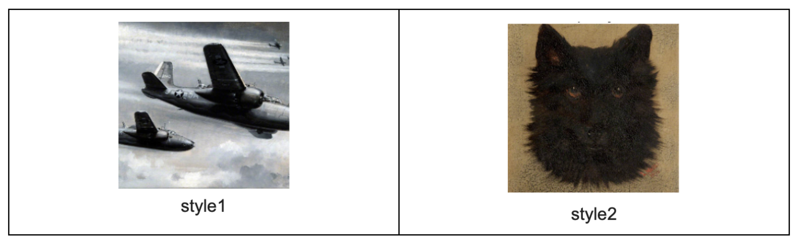
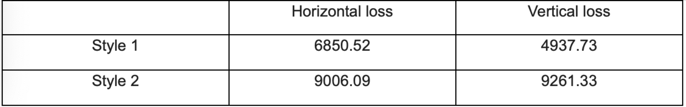

# CS585-Styler-Transfer

## What is Neural Style Transfer 
Neural style transfer is a optimization technique used to take two images, one is the content image, another is the style image. And the output image looks like the content image, but the style will look like the style reference image. Neural style transfer implemented by optimizing the output image to match the content statistics of the content image and the style statistics of the style reference image. These statistics are extracted from the images using a convolutional network.

## Project Overview
For this project, we mainly use TensorFlow_hub to realize style transfer. And our key points are not about to train an style transfer model. What we mind is what kind of styles are hard to learn or what kind of content pictures(especially face images) will fail to transfer. We try many groups of content images and style images to find problems in style transfer .

## Problems in Style Transfer
This session is about the problems we find during experiment.
### 1. Falsely learn the color distribution of style images
When there is an obvious boundary between the upper and lower colors in the style image, the original image will retain such features after conversion, even if there is no obvious boundary between the upper and lower colors in the original image.

  

We use the sum of all the pixels on the Y-axis of the stylized image to measure this problem. The following table shows the stylized image curves for normal style images (output stylized images are reasonably well) and special cases (the styles we mentioned above) on 150 different celebrities’ faces. A stylized image with distinct boundaries will result in a stylized image with very clear steps in the curve shown below. This may be because style transfer not only learns the style of style image, but also leaves the color distribution to the stylized image.

  

### 2. Falsely learn the edge distribution of style images
Human face is like a circle, which means that the vertical edges is roughly equal to the horizontal edges. At the mean time, we notice that if a style image contain more horizontal edges than vertical edges. The stylized image using this style will also show the same feature and vise versa. Here we show two style image the first style image contain more horizontal edges than vertical edges, while the second one is like human faces who have almost equal horizontal and vertical edges. 

  

And the table below shows the computed sum of horizontal and vertical edges. And the result is same with the conclusion we draw above.

  

